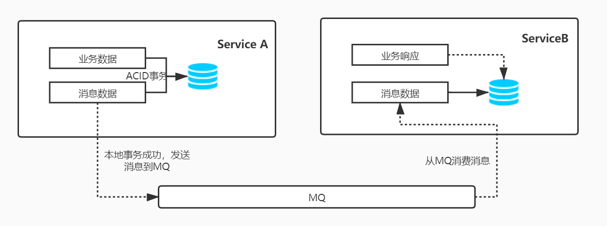

# Shashlik.Eventbus

[](https://github.com/dotnet-shashlik/shashlik.eventbus)
[](https://github.com/dotnet-shashlik/shashlik.eventbus/blob/main/LICENSE)

---

Shashlik.EventBus 顾名思义，.NET 事件总线，同时也是分布式事务、延迟事件解决方案，不依赖于Shashlik基础框架（仅依赖了Shashlik.Utils工具包）。Shashlik.EventBus 设计的目标就是高性能、简单、易用、易扩展，且现已全面支持.NET5，采用最宽松的 MIT 开源协议。

## 开发背景

说起.NET 分布式事务和事件总线，首先应该提到必须就是[CAP](https://github.com/dotnetcore/CAP)，诚然`CAP`是一款优秀的框架，采用基于本地消息表的异步确保来达到最终一致性的的分布式事务解决方案也是非常经典，被广泛应用的方案。我也是从`CAP 2.0`版本就开始使用，也算是半个忠实用户。那我为什么还是吃饱了撑的要开发 Shashlik.EventBus 呢？这得在`CAP`使用的过程中产生的问题说起，PS：这里不是要数落`CAP`，希望杨大别怪罪，只是对`CAP`的一些设计思路不太认同。Shashlik.EventBus 也不是`CAP`的弥补，更不是`CAP`的副本，而且基于本地消息表的分布式事务的另一个实现。

- `CAP`对事务的入侵太强。
- 比较繁琐的生产与消费定义（基于特性）。
- 缺少必要的测试，我在生产环境经历过几个比较严重的 BUG，具体不细谈。
- 缺少延迟事件功能，`CAP`也有issue提过此功能，但杨大的解释是可以集成`Hangfire+CAP`的方式，这个我持保留意见。

基于这几个方面决定自行开发，并完全开源，为.NET 社区贡献一份力量。再次强调，Shashlik.EventBus 的目标不是为了替换`CAP`，只是为了大家多一个选择，事实上Shashlik也有对`CAP`的集成，详见[Shashlik](https://github.com/dotnet-shashlik/shashlik)。Shashlik 承诺会一直维护下去（虽然目前只有 2 个人，同时希望大家积极参与进来）。已集成 github action 来执行每次版本发布前的完整测试，当前测试覆盖率已达到 85%，尽量保证不出现低级 BUG。

## Nuget

| PackageName                         | Nuget                                                                                                                                    | Description                                        |
| ----------------------------------- | ---------------------------------------------------------------------------------------------------------------------------------------- | -------------------------------------------------- |
| Shashlik.EventBus.Abstract          | [](https://www.nuget.org/packages/Shashlik.EventBus.Abstract)          | 接口抽象                                           |
| Shashlik.EventBus                   | [](https://www.nuget.org/packages/Shashlik.EventBus)                   | 基础包，消息收发、存储抽象，以及事件处理的默认实现 |
| Shashlik.EventBus.MySql             | [](https://www.nuget.org/packages/Shashlik.EventBus.MySql)             | MySql 消息存储驱动                                 |
| Shashlik.EventBus.PostgreSQL        | [](https://www.nuget.org/packages/Shashlik.EventBus.PostgreSQL)        | PostgreSQL 消息存储驱动                            |
| Shashlik.EventBus.SqlServer         | [](https://www.nuget.org/packages/Shashlik.EventBus.SqlServer)         | SqlServer 消息存储驱动                             |
| Shashlik.EventBus.Kafka             | [](https://www.nuget.org/packages/Shashlik.EventBus.Kafka)             | kafka 消息收发驱动                                 |
| Shashlik.EventBus.RabbitMQ          | [](https://www.nuget.org/packages/Shashlik.EventBus.RabbitMQ)          | RabbitMQ 消息收发驱动                              |
| Shashlik.EventBus.RelationDbStorage | [](https://www.nuget.org/packages/Shashlik.EventBus.RelationDbStorage) | 关系型数据库事务实现                                 |
| Shashlik.EventBus.Extensions.EfCore | [](https://www.nuget.org/packages/Shashlik.EventBus.Extensions.EfCore) | EF 扩展，方便通过 EF 执行事件的发布与事务处理      |
| Shashlik.EventBus.MemoryQueue       | [](https://www.nuget.org/packages/Shashlik.EventBus.MemoryQueue)       | 内存消息驱动，仅适用于测试                                       |
| Shashlik.EventBus.MemoryStorage     | [](https://www.nuget.org/packages/Shashlik.EventBus.MemoryStorage)     | 内存消息存储，仅适用于测试                                       |

## 架构



**EventBus不能保证业务消息的幂等性，为了保证消息的可靠传输，EventBus以及消息中间件对消息QOS处理等级必须为`At least once`：至少到达一次，一般消息中间件都需要开启消息持久化避免消息丢失。简单的说就是一个事件处理类可能处理多次同一个事件，比如用户订单付款完成为一个事件，付款完成后需要修改订单状态为待发货，那么在事件处理类中可能收到多次这个订单的付款完成事件，那么业务的幂等性处理就可以使用悲观锁，判断订单状态，如果订单状态已经为待发货，则直接返回并忽略本次事件响应。**

## Getting Started

场景如下：一个新用户注册以后有以下需求：1.发送欢迎注册短信；2.发放新用户消费券；3.30分钟后推送新用户优惠活动信息。

1. 服务配置，这里以MySql+RabbitMQ为例：

```c#
    services.AddEventBus(r =>
        {
            // 这些都是缺省配置，可以直接services.AddEventBus()
            // 运行环境，注册到MQ的事件名称和事件处理名称会带上此后缀
            r.Environment = "Production";
            // 确认事务是否已提交的时间范围，默认3分钟内
            r.ConfirmTransactionSeconds = 60 * 3;
            // 最大失败重试次数，默认60次
            r.RetryFailedMax = 60;
            // 消息重试间隔，默认2分钟
            r.RetryIntervalSeconds = 60 * 2;
            // 单次重试消息数量限制，默认100
            r.RetryLimitCount = 100;
            // 成功的消息过期时间，默认3天，失败的消息永不过期，必须处理
            r.SucceedExpireHour = 24 * 3;
            // 重试器工作时间间隔，默认5秒
            r.RetryWorkingIntervalSeconds = 5;
            // 消息处理失败后，重试器介入时间，默认5分钟后
            r.StartRetryAfterSeconds = 60 * 5;
            // 重试器并行执行数量，默认5
            r.RetryMaxDegreeOfParallelism = 5;
        })
        // 使用ef DbContext mysql
        .AddMySql<DemoDbContext>()
        // 配置RabbitMQ
        .AddRabbitMQ(r =>
        {
            r.Host = "localhost";
            r.UserName = "rabbit";
            r.Password = "123123";
        });
```

2. 定义事件

```c#

    // 新用户注册完成事件，实现接口IEvent
    public class NewUserEvent : IEvent
    {
        public string Id { get;set; }
        public string Name { get; set; }
    }
    
    // 定义新用户注册延迟活动推送事件
    public class NewUserPromotionEvent : IEvent
    {
        public string Id { get;set; }
        public string Name { get; set; }
        public string PromotionId { get; set; }
    }

```

3. 发布事件

```c#

public class UserManager
{
    public UserManager(IEventPublisher eventPublisher, DemoDbContext dbContext)
    {
        EventPublisher = eventPublisher;
        DbContext = dbContext;
    }

    private IEventPublisher EventPublisher { get; }
    private DemoDbContext DbContext { get; }

    public async Task CreateUserAsync(UserInput input)
    {
        // 开启本地事务
        using var tran = await DbContext.DataBase.BeginTransactionAsync();
        try
        {
            // 创建用户逻辑处理...

            // 发布新用户事件
            // 通过注入IEventPublisher发布事件，需要传入事务上下文数据
            await EventPublisher.PublishAsync(new NewUserEvent{
                Id = user.Id,
                Name = input.Name
            }, DbContext.GetTransactionContext());

            // 发布延迟事件
            // 通过ef扩展，直接使用DbContext发布事件，自动使用当前上下文事务
            await DbContext.PublishEventAsync(new NewUserPromotionEvent{
                Id = user.Id,
                Name = input.Name,
                PromotionId = "1"
            }, DatetimeOffset.Now.AddMinutes(30));

            // 提交本地事务
            await tran.CommitAsync();
        }catch(Exception ex)
        {
            // 回滚事务，消息数据也将回滚不会发布
            await tran.RollbackAsync();
        }
    }
}

```

4. 定义事件处理类

```c#
    
    // 一个事件可以有多个处理类，可以分布在不同的微服务中
    // 用于发送短信
    public class NewUserEventForSmsHandler : IEventHandler<NormalEvent>
    {
        public async Task Execute(NormalEvent @event, IDictionary<string, string> items)
        {
            // 发送短信...
        }
    }


    // 用于发放消费券
    public class NewUserEventForCouponsHandler : IEventHandler<NormalEvent>
    {
        public async Task Execute(NormalEvent @event, IDictionary<string, string> items)
        {
            // 业务处理...
        }
    }

    // 事件处理类不区分普通事件和延迟事件
    public class NewUserPromotionEventHandler : IEventHandler<NewUserPromotionEvent>
    {
        public async Task Execute(NewUserPromotionEvent @event, IDictionary<string, string> items)
        {
            // 业务处理...
        }
    }    
```

## 扩展

如果默认实现不能满足你的需求，可以自行实现可扩展接口，并注册即可。

- `IMsgIdGenerator`：消息Id生成器，是指传输的全局唯一id，不是指存储的id。
- `IEventPublisher`：事件发布处理类。
- `IMessageSerializer`：消息序列化、反序列化处理类。
- `IReceivedMessageRetryProvider`：已接收消息重试器。
- `IPublishedMessageRetryProvider`：已发布消息重试器。
- `IMessageSendQueueProvider`：消息发送处理队列。
- `IMessageReceiveQueueProvider`：消息接收处理队列。
- `IEventHandlerInvoker`：事件处理执行器。
- `IEventNameRuler`：事件名称规则生成。
- `IEventHandlerNameRuler`：事件处理名称规则生成。
- `IEventHandlerFindProvider`：事件处理类查找器
- `IMessageListener`：消息监听处理器。
- `IReceivedDelayEventProvider`：已接收的延迟事件处理。
- `IExpiredMessageProvider`：已过期消息删除处理。
- `IMessageStorageInitializer`：存储介质初始化。
- `IMessageStorage`：消息存储、读取等操作。
- `IMessageSender`：消息发送器。
- `IMessageListener`：消息监听处理器。
- `IEventSubscriber`：事件订阅器。

例：
```c#

    // 替换默认的IMsgIdGenerator
    service.AddSingleton<IMsgIdGenerator,CustomMsgIdGenerator>();
    service.AddEventBus()
        .AddMemoryQueue()
        .AddMemoryStorage();

```

## Wiki

[Wiki](https://github.com/dotnet-shashlik/shashlik.eventbus/wiki)